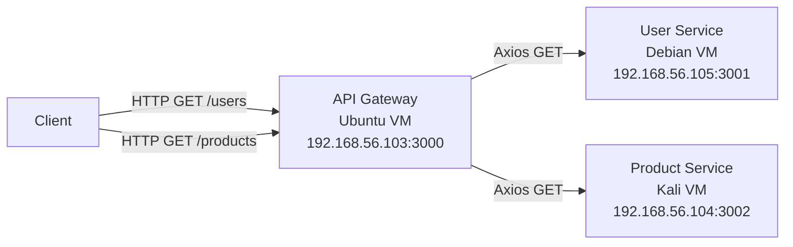

# Microservice Deployment on Oracle VirtualBox

This project demonstrates a microservice architecture deployed across multiple Virtual Machines (VMs) using Node.js. The system consists of three distinct services: an API Gateway, a User Service, and a Product Service, each running on a dedicated VM with a specific operating system.

## 🏗 Architecture Overview

The system follows a standard microservices pattern where the **API Gateway** acts as the single entry point for all client requests. It routes requests to the appropriate backend services (**User Service** and **Product Service**) using HTTP requests via Axios.

### System Diagram



## 🚀 Services & Network Configuration

| Service Name | Role | OS | IP Address | Port | Endpoint |
|--------------|------|----|------------|------|----------|
| **API Gateway** | Entry Point / Router | Ubuntu | `192.168.56.103` | `3000` | `/`, `/users`, `/products` |
| **User Service** | User Data Provider | Debian | `192.168.56.105` | `3001` | `/users` |
| **Product Service** | Product Data Provider | Kali Linux | `192.168.56.104` | `3002` | `/products` |

## 🛠 Prerequisites

- **Oracle VirtualBox**: Installed on your host machine.
- **Node.js & npm**: Installed on each VM.
- **Network Setup**: All VMs must be on the same **Host-Only Network** (e.g., `vboxnet0`) to communicate with the host and each other using the specified static IP addresses.

---

## 📦 Project Structure

```
microservices-project/
├── api-gateway/         # Node.js API Gateway
│   ├── package.json
│   └── server.js
├── user-service/        # User Microservice
│   ├── package.json
│   └── server.js
├── product-service/     # Product Microservice
│   ├── package.json
│   └── server.js
└── README.md            # Project Documentation
```

---

## 🔧 Installation & Deployment Instructions

### 1. Network Configuration (VirtualBox)

1.  Open **VirtualBox**.
2.  Go to **File > Host Network Manager**.
3.  Create or configure a network (e.g., `vboxnet0`) with IPv4 Address `192.168.56.1` and Mask `255.255.255.0`.
4.  For each VM (Ubuntu, Debian, Kali):
    *   Go to **Settings > Network**.
    *   Attach **Adapter 1** to **Host-Only Adapter**.
    *   Select `vboxnet0`.
5.  **Inside each VM**, configure the static IP address as per the table above.
    *   *Example (Ubuntu/Debian - Netplan or `/etc/network/interfaces`):*
        ```yaml
        # Example netplan config
        network:
          version: 2
          ethernets:
            enp0s3:
              dhcp4: no
              addresses: [192.168.56.103/24] # Change IP per VM
        ```

### 2. Deploy User Service (Debian VM)

1.  Copy the `user-service` folder to the Debian VM.
2.  Open a terminal in the folder.
3.  Install dependencies:
    ```bash
    npm install
    ```
4.  Start the service:
    ```bash
    node server.js
    ```
5.  Verify it's running: `http://192.168.56.105:3001/users`

### 3. Deploy Product Service (Kali VM)

1.  Copy the `product-service` folder to the Kali VM.
2.  Open a terminal in the folder.
3.  Install dependencies:
    ```bash
    npm install
    ```
4.  Start the service:
    ```bash
    node server.js
    ```
5.  Verify it's running: `http://192.168.56.104:3002/products`

### 4. Deploy API Gateway (Ubuntu VM)

1.  Copy the `api-gateway` folder to the Ubuntu VM.
2.  Open a terminal in the folder.
3.  Install dependencies:
    ```bash
    npm install
    ```
4.  Start the gateway:
    ```bash
    node server.js
    ```
5.  **Test the Full System** from your Host Machine or Browser:
    *   **Get Users**: [http://192.168.56.103:3000/users](http://192.168.56.103:3000/users)
    *   **Get Products**: [http://192.168.56.103:3000/products](http://192.168.56.103:3000/products)

---

## 🧪 Testing

Once all services are running, you can test the endpoints using `curl` or a browser.

**Request to Gateway for Users:**
```bash
curl http://192.168.56.103:3000/users
```
**Expected Output:**
```json
[
  { "id": 1, "name": "John Doe", "email": "john@example.com", "role": "Admin" },
  ...
]
```

**Request to Gateway for Products:**
```bash
curl http://192.168.56.103:3000/products
```
**Expected Output:**
```json
[
  { "id": 101, "name": "Wireless Mouse", "price": 29.99, "category": "Electronics" },
  ...
]
```

## 📝 Notes

*   Ensure firewalls (ufw, iptables) on the VMs allow traffic on ports 3000, 3001, and 3002.
*   If `npm install` fails, ensure `nodejs` and `npm` are installed: `sudo apt update && sudo apt install nodejs npm`.
